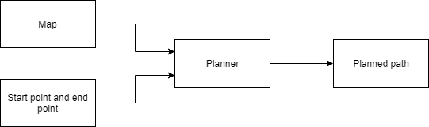

# RRT-Star

[](https://travis-ci.org/Mayavan/rrt-star)
[](https://coveralls.io/github/Mayavan/rrt-star?branch=master)
---

## Overview

A path planner module to find a feasible path from the given start point to the given end point using RRT*. This planner can be used in the Acme industrial AGVs to quickly find a path from one point to another in a factory workspace while avoiding obstacles. Sampling based algorithm like RRT* give quick solution to using randomized sampling in search space. The module will require an image with black and white pixels (black specifying obstacles and white specifying free space), the scale of pixels in the map image, the clearance distance required for the robot, the minimum number of iterations, the start point and the target point to return a sequence of points as the result of the RRT* planning algorithm.



## License

The MIT license definition for this project can be viewed [here](https://opensource.org/licenses/MIT)
.

## SIP Process

SIP Process is detailed in [here](https://docs.google.com/spreadsheets/d/1cSA6AFp7Eeqrku6nSDFxkTTb4TWTfvhlCbPjua-hT9A/edit?usp=sharing)

## Installing Dependencies

```bash
  # OpenCV install
  sudo apt-get install -y build-essential
  sudo apt-get install -y cmake git libgtk2.0-dev pkg-config libavcodec-dev libavformat-dev libswscale-dev
  sudo apt-get install -y python-dev python-numpy libtbb2 libtbb-dev libjpeg-dev libpng-dev libtiff-dev libjasper-dev libdc1394-22-dev

  # Download from github
  curl -sL https://github.com/Itseez/opencv/archive/3.3.0.zip > opencv.zip
  unzip opencv.zip
  cd opencv-3.3.0
  mkdir build
  cd build
  cmake -D CMAKE_BUILD_TYPE=RELEASE -D CMAKE_INSTALL_PREFIX=/usr/local D WITH_TBB=ON -D BUILD_NEW_PYTHON_SUPPORT=ON -D WITH_V4L=ON -D INSTALL_C_EXAMPLES=ON -D INSTALL_PYTHON_EXAMPLES=ON -D BUILD_EXAMPLES=ON -D WITH_QT=ON -D WITH_OPENGL=ON ..
  make -j4
  sudo make install
  
  sudo sh -c 'echo "/usr/local/lib" > /etc/ld.so.conf.d/opencv.conf'
  sudo ldconfig
  cd ../../
 ```

## Standard install and build via command-line

```bash
git clone --recursive https://github.com/Mayavan/rrt-star
cd <path to repository>
mkdir build
cd build
cmake ..
make
```

## Run demo

```bash
./app/shell-app
```

## Run test

```bash
./test/cpp-test
```

## Generate Doxygen

```bash
doxygen Doxygen
```